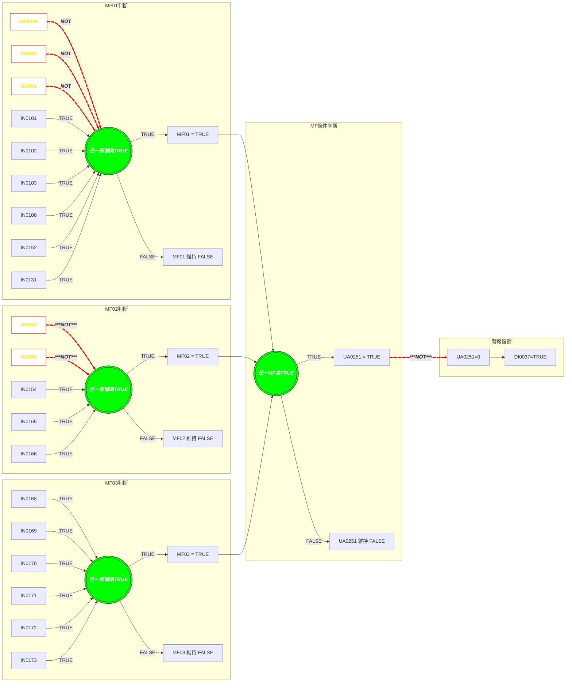
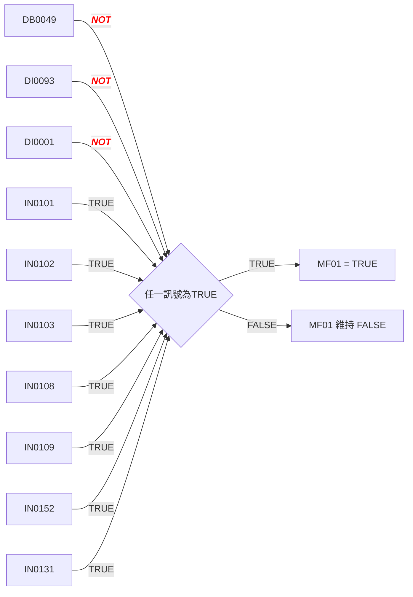
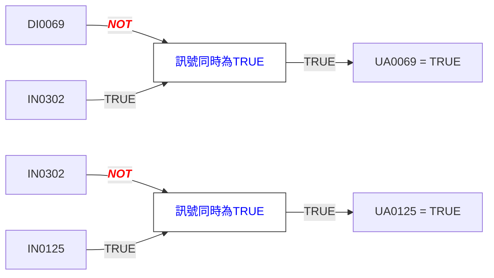
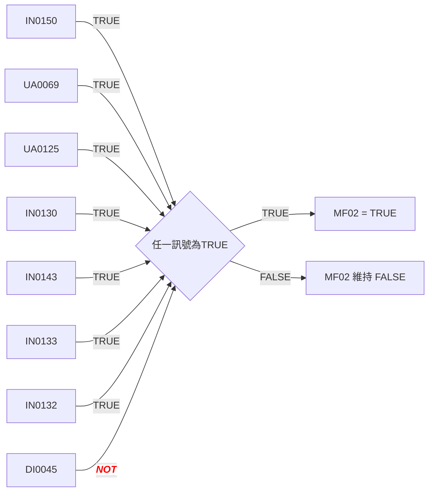

# 工業控制場景下，生產設備間的訊號連鎖控制

## EXAMPLE1

```mermaid
flowchart LR
classDef redBold fill:#fff,stroke:red, font-weight:bold,font-style:italic, color: #fff000
classDef GreenBold fill:#0f0,stroke:black,font-weight:bold,font-style:italic, color:#fff
    subgraph MF01判斷
        A1[DB0049]  z1@==>|NOT| C1(((任一訊號為TRUE)))
        B1[DI0093] z2@==>|NOT| C1
        D1[DI0001] z3@==>|NOT| C1 
        linkStyle 0,1,2 stroke:red,font-style:italic, font-weight:bold, label-color:red

        G1[IN0101] -->|TRUE| C1
        H1[IN0102] -->|TRUE| C1
        I1[IN0103] -->|TRUE| C1
        L1[IN0108] -->|TRUE| C1
        J1[IN0152] -->|TRUE| C1
        K1[IN0131] -->|TRUE| C1
        C1 -->|TRUE| E1[MF01 = TRUE]
        C1 -->|FALSE| F1[MF01 維持 FALSE]
        
        z1@{ animate: true}
        z2@{ animate: true}
        z3@{ animate: true}

         class A1,B1,D1 redBold
         class C1 GreenBold
    end

    subgraph MF02判斷
        A2[DI0052] z11@==>|***NOT***| C2     
        B2[DI0050] z12@==>|***NOT***| C2
        linkStyle 11,12 stroke:red,font-style:italic, font-weight:bold
        
        G2[IN0154] -->|TRUE| C2
        H2[IN0165] -->|TRUE| C2
        I2[IN0166] -->|TRUE| C2
        C2(((任一訊號為TRUE))) -->|TRUE| E2[MF02 = TRUE]
        C2 -->|FALSE| F2[MF02 維持 FALSE]
        z11@{ animate: true}
        z12@{ animate: true}
        class C2 GreenBold

        class A2,B2 redBold
    end

    subgraph MF03判斷
        A3[IN0168] -->|TRUE| C3
        B3[IN0169] -->|TRUE| C3
        D3[IN0170] -->|TRUE| C3
        G3[IN0171] -->|TRUE| C3
        H3[IN0172] -->|TRUE| C3
        I3[IN0173] -->|TRUE| C3
        C3(((任一訊號為TRUE))) -->|TRUE| E3[MF03 = TRUE]
        C3 -->|FALSE| F3[MF03 維持 FALSE]
        class C3 GreenBold
    end

    subgraph MF條件判斷
        E1 --> C4(((任一MF為TRUE)))
        E2 --> C4
        E3 --> C4
        C4 -->|TRUE| K4[UA0251 = TRUE]
        C4 -->|FALSE| K5[UA0251 維持 FALSE]
        class C4 GreenBold
    end

    subgraph 警報復歸
        K4 z31@==>|***NOT***| B4[UA0251=0]
        B4 --> B10[DI0037=TRUE]
        z31@{ animate: true}
        
        linkStyle 31 stroke:red,font-style:italic, font-weight:bold 
    end
```

## MF01

```mermaid
flowchart LR
        A1[DB0049] -->|"<font color='red' style='background-color:white;font-style:italic; font-weight:bold'>NOT</font>"| C1{任一訊號為TRUE}
        B1[DI0093] -->|"<font color='red' style='background-color:white;font-style:italic; font-weight:bold'>NOT</font>"| C1
        D1[DI0001] -->|"<font color='red' style='background-color:white;font-style:italic; font-weight:bold'>NOT</font>"| C1
        G1[IN0101] -->|TRUE| C1
        H1[IN0102] -->|TRUE| C1
        I1[IN0103] -->|TRUE| C1
        L1[IN0108] -->|TRUE| C1
        M1[IN0109] -->|TRUE| C1
        J1[IN0152] -->|TRUE| C1
        K1[IN0131] -->|TRUE| C1
        C1{任一訊號為TRUE} -->|TRUE| E1[MF01 = TRUE]
        C1 -->|FALSE| F1[MF01 維持 FALSE]
```

## 連鎖警報

```mermaid
flowchart LR
        A2[DI0069] -->|"<font color='red' style='background-color:white;font-style:italic; font-weight:bold'>NOT</font>"| C3[訊號同時為TRUE]
        G2[IN0302] -->|TRUE| C3
        C3 -->|TRUE| E3[UA0069 = TRUE]
        style C3 fill:#fff,stroke:#333,stroke-width:1px,color:#0000ff

        A4[IN0302] -->|"<font color='red' style='background-color:white;font-style:italic; font-weight:bold'>NOT</font>"| C4[訊號同時為TRUE]
        G4[IN0125] -->|TRUE| C4
        C4 -->|TRUE| E4[UA0125 = TRUE]
        style C4 fill:#fff,stroke:#333,stroke-width:1px,color:#0000ff
```

## MF02

```mermaid
flowchart LR
        A5[IN0150] -->|TRUE| C5{任一訊號為TRUE}
        B5[UA0069] -->|TRUE| C5
        D5[UA0125] -->|TRUE| C5
        G5[IN0130] -->|TRUE| C5
        H5[IN0143] -->|TRUE| C5
        I5[IN0133] -->|TRUE| C5
        J5[IN0132] -->|TRUE| C5
        K5[DI0045] -->|"<font color='red' style='background-color:white;font-style:italic; font-weight:bold'>NOT</font>"| C5
        C5 -->|TRUE| E5[MF02 = TRUE]
        C5 -->|FALSE| F5[MF02 維持 FALSE]
```
