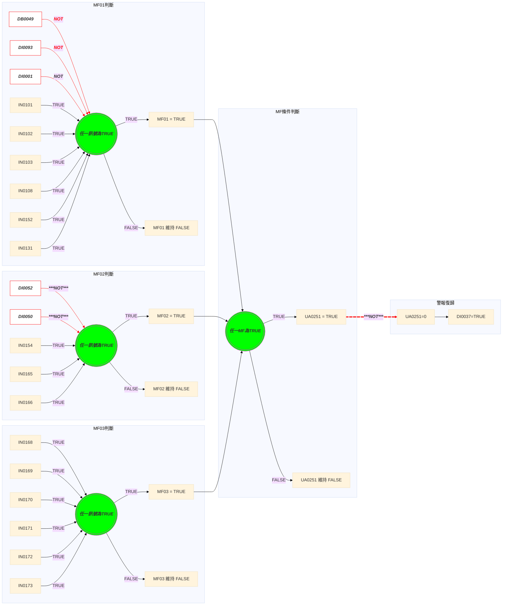

# 工業控制場景下，生產設備間的訊號連鎖控制

## EXAMPLE1

```mermaid
%%{init:{ "theme":"base" }}%%
flowchart LR
    subgraph MF01判斷
    classDef redBold fill:#fff,stroke:red, font-weight:bold,font-style:italic
    classDef GreenBold fill:#0f0,stroke: #ff0ff0,font-weight:bold,font-style:italic
        A1[DB0049] -->|<span style="color: red; font-size: 16px;">NOT</span>| C1(((任一訊號為TRUE)))
        B1[DI0093] -->|<span style="color: red; font-size: 16px;">NOT</span>| C1
        D1[DI0001] -->|NOT| C1 

        G1[IN0101] -->|TRUE| C1
        H1[IN0102] -->|TRUE| C1
        I1[IN0103] -->|TRUE| C1
        L1[IN0108] -->|TRUE| C1
        J1[IN0152] -->|TRUE| C1
        K1[IN0131] -->|TRUE| C1
        C1 -->|TRUE| E1[MF01 = TRUE]
        C1 -->|FALSE| F1[MF01 維持 FALSE]
        
        class A1,B1,D1 redBold
        class C1 GreenBold

            linkStyle 0,1,2 stroke:red,font-style:italic, font-weight:bold
    end

    subgraph MF02判斷
        A2[DI0052] -->|***NOT***| C2     
        B2[DI0050] -->|***NOT***| C2
        linkStyle 11,12 stroke:red,font-style:italic, font-weight:bold
        
        G2[IN0154] -->|TRUE| C2
        H2[IN0165] -->|TRUE| C2
        I2[IN0166] -->|TRUE| C2
        C2(((任一訊號為TRUE))) -->|TRUE| E2[MF02 = TRUE]
        C2 -->|FALSE| F2[MF02 維持 FALSE]

        class C2 GreenBold
        class A2,B2 redBold
    end

    subgraph MF03判斷
        A3[IN0168] -->|TRUE| C3
        B3[IN0169] -->|TRUE| C3
        D3[IN0170] -->|TRUE| C3
        G3[IN0171] -->|TRUE| C3
        H3[IN0172] -->|TRUE| C3
        I3[IN0173] -->|TRUE| C3
        C3(((任一訊號為TRUE))) -->|TRUE| E3[MF03 = TRUE]
        C3 -->|FALSE| F3[MF03 維持 FALSE]
        class C3 GreenBold
    end

    subgraph MF條件判斷
        E1 --> C4(((任一MF為TRUE)))
        E2 --> C4
        E3 --> C4
        C4 -->|TRUE| K4[UA0251 = TRUE]
        C4 -->|FALSE| K5[UA0251 維持 FALSE]
        class C4 GreenBold
    end

    subgraph 警報復歸
        K4 z31@==>|***NOT***| B4[UA0251=0]
           z31@{ animate: true}
        B4 --> B10[DI0037=TRUE]
        
        linkStyle 31 stroke:red,font-style:italic, font-weight:bold 
    end
```
