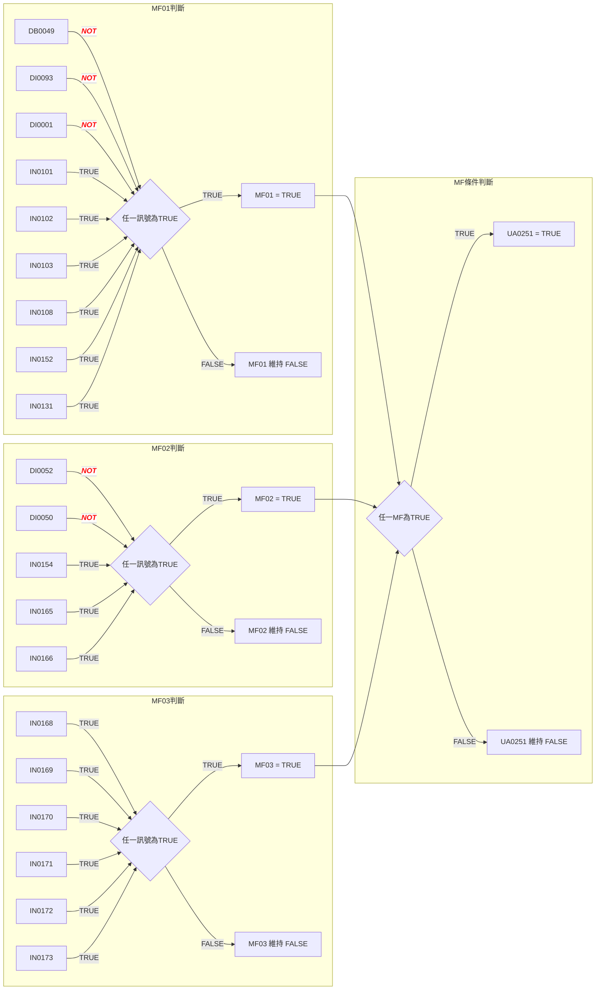

# mermaid設定

## SEQ002-E210-每一段都分開

```mermaid
flowchart LR
    subgraph MF01判斷
        A1[DB0049] -->|"<font color='red' style='background-color:white;font-style:italic; font-weight:bold'>NOT</font>"| C1{任一訊號為TRUE}
        B1[DI0093] -->|"<font color='red' style='background-color:white;font-style:italic; font-weight:bold'>NOT</font>"| C1
        D1[DI0001] -->|"<font color='red' style='background-color:white;font-style:italic; font-weight:bold'>NOT</font>"| C1
        G1[IN0101] -->|TRUE| C1
        H1[IN0102] -->|TRUE| C1
        I1[IN0103] -->|TRUE| C1
        L1[IN0108] -->|TRUE| C1
        J1[IN0152] -->|TRUE| C1
        K1[IN0131] -->|TRUE| C1
        C1{任一訊號為TRUE} -->|TRUE| E1[MF01 = TRUE]
        C1 -->|FALSE| F1[MF01 維持 FALSE]
    end

    subgraph MF02判斷
        A2[DI0052] -->|"<font color='red' style='background-color:white;font-style:italic; font-weight:bold'>NOT</font>"| C2
        B2[DI0050] -->|"<font color='red' style='background-color:white;font-style:italic; font-weight:bold'>NOT</font>"| C2
        G2[IN0154] -->|TRUE| C2
        H2[IN0165] -->|TRUE| C2
        I2[IN0166] -->|TRUE| C2
        C2{任一訊號為TRUE} -->|TRUE| E2[MF02 = TRUE]
        C2 -->|FALSE| F2[MF02 維持 FALSE]
    end

    subgraph MF03判斷
        A3[IN0168] -->|TRUE| C3
        B3[IN0169] -->|TRUE| C3
        D3[IN0170] -->|TRUE| C3
        G3[IN0171] -->|TRUE| C3
        H3[IN0172] -->|TRUE| C3
        I3[IN0173] -->|TRUE| C3
        C3{任一訊號為TRUE} -->|TRUE| E3[MF03 = TRUE]
        C3 -->|FALSE| F3[MF03 維持 FALSE]
    end

    subgraph MF條件判斷
        E1 --> C4{任一MF為TRUE}
        E2 --> C4
        E3 --> C4
        C4 -->|TRUE| K4[UA0251 = TRUE]
        C4 -->|FALSE| K5[UA0251 維持 FALSE]
    end
```

## 警報復歸

```mermaid
    flowchart LR
        A4[NOT-UA0251] -->|TRUE| B4[DO0037=TRUE]
```
