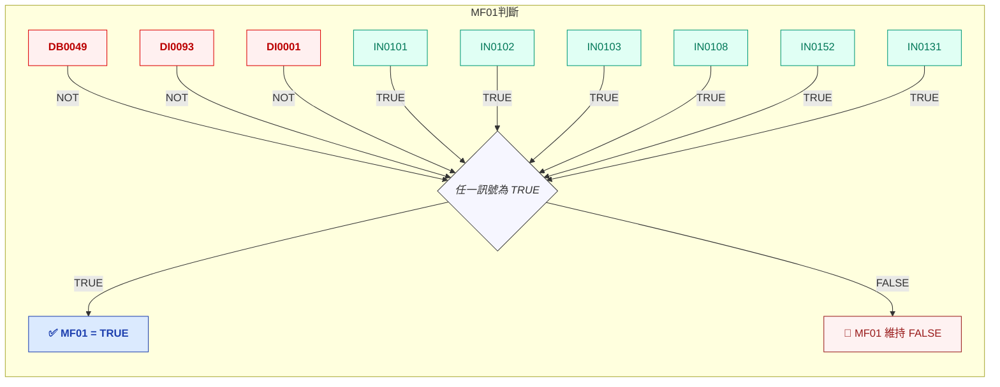

# MermaidTEST

```mermaid
flowchart LR
    subgraph MF01判斷
        A1[DB0049] -->|NOT| C1{任一訊號為 TRUE}
        B1[DI0093] -->|NOT| C1
        D1[DI0001] -->|NOT| C1
        G1[IN0101] -->|TRUE| C1
        H1[IN0102] -->|TRUE| C1
        I1[IN0103] -->|TRUE| C1
        L1[IN0108] -->|TRUE| C1
        J1[IN0152] -->|TRUE| C1
        K1[IN0131] -->|TRUE| C1
        C1 -->|TRUE| E1[✅ MF01 = TRUE]
        C1 -->|FALSE| F1[🚫 MF01 維持 FALSE]
    end

    %% 🌈 樣式定義
    classDef notInput fill:#fff0f0,stroke:#d00,color:#b00,font-weight:bold
    classDef trueInput fill:#e0fff4,stroke:#009977,color:#007757
    classDef judge fill:#f6f6ff,stroke:#444,font-style:italic
    classDef outputTrue fill:#dbeafe,stroke:#1e40af,color:#1e40af,font-weight:bold
    classDef outputFalse fill:#fef2f2,stroke:#991b1b,color:#991b1b

    %% 🎯 節點套用樣式
    class A1,B1,D1 notInput
    class G1,H1,I1,J1,K1,L1 trueInput
    class C1 judge
    class E1 outputTrue
    class F1 outputFalse
```
