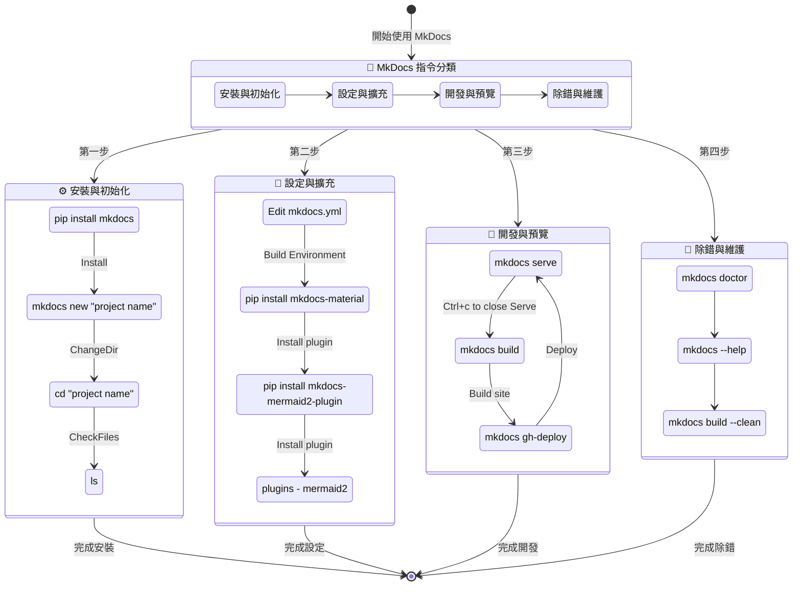
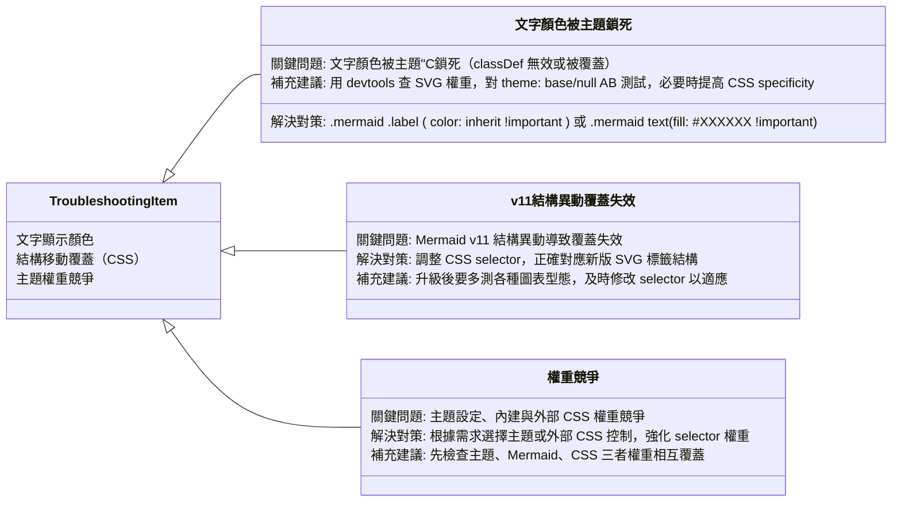

# 系統化探索 MkDocs × Mermaid 心得全紀錄

## 🔨Deployment

```mermaid
stateDiagram-v2  
    direction TB  // 方向設定為由上至下 (Top to Bottom)  

    %% 狀態定義 (State Definitions)  
    %% 使用 state 來定義複合狀態 (一個大的分類)  
    
    state "📜 MkDocs 指令分類" as MkDocsCommands {  
     direction LR
        安裝與初始化: 安裝與初始化  
        開發與預覽: 開發與預覽  
        設定與擴充: 設定與擴充  
        除錯與維護: 除錯與維護  

        安裝與初始化 --> 設定與擴充 
        設定與擴充 --> 開發與預覽   
        開發與預覽 --> 除錯與維護  
    }  

    state "⚙️ 安裝與初始化" as Setup {  
        Install: pip install mkdocs  
        NewProject: mkdocs new "project name"  
        ChangeDir: cd "project name"  
        CheckFiles: ls  

        Install --> NewProject : Install 
        NewProject --> ChangeDir :  ChangeDir
        ChangeDir --> CheckFiles : CheckFiles
    }  

    state "🎨 設定與擴充" as Config {  
        EditConfig: Edit mkdocs.yml  
        InstallTheme: pip install mkdocs-material  
        InstallPlugin: pip install mkdocs-mermaid2-plugin  
        EnablePlugin: plugins - mermaid2  

        EditConfig --> InstallTheme :Build Environment  
        InstallTheme --> InstallPlugin : Install plugin
        InstallPlugin --> EnablePlugin : Install plugin
    }  

    state "🚀 開發與預覽" as Dev {  
        Serve: mkdocs serve  
        Build: mkdocs build  
        Deploy: mkdocs gh-deploy  

        Build --> Deploy  :Build site
        Deploy --> Serve :Deploy
        Serve --> Build :Ctrl+c to close Serve
    }  

    state "🔧 除錯與維護" as Debug {  
        Doctor: mkdocs doctor  
        Help: mkdocs --help  
        CleanBuild: mkdocs build --clean  

        Doctor --> Help  
        Help --> CleanBuild  
    }  

    %% 起點與主要流程  
    [*] --> MkDocsCommands : 開始使用 MkDocs  

    MkDocsCommands --> Setup : 第一步   
    MkDocsCommands --> Config : 第二步 
    MkDocsCommands --> Dev : 第三步  
    MkDocsCommands --> Debug : 第四步  

    %% 終點  
    Setup --> [*] : 完成安裝  
    Config --> [*] : 完成設定  
    Dev --> [*] : 完成開發  
    Debug --> [*] : 完成除錯  

```

## 💉Troubleshooting

```mermaid
classDiagram 
    direction LR
    class TroubleshootingItem {
        文字顯示顏色
        結構移動覆蓋（CSS）
        主題權重競爭
    }

    class 文字顏色被主題鎖死 {
        關鍵問題: 文字顏色被主題"C鎖死（classDef 無效或被覆蓋）
        解決對策: .mermaid .label ( color: inherit !important ) 或 .mermaid text ( fill: #XXXXXX !important )
        補充建議: 用 devtools 查 SVG 權重，對 theme: base/null AB 測試，必要時提高 CSS specificity
    }

    class v11結構異動覆蓋失效 {
        關鍵問題: Mermaid v11 結構異動導致覆蓋失效
        解決對策: 調整 CSS selector，正確對應新版 SVG 標籤結構
        補充建議: 升級後要多測各種圖表型態，及時修改 selector 以適應
    }

    class 權重競爭 {
        關鍵問題: 主題設定、內建與外部 CSS 權重競爭
        解決對策: 根據需求選擇主題或外部 CSS 控制，強化 selector 權重
        補充建議: 先檢查主題、Mermaid、CSS 三者權重相互覆蓋
    }

    TroubleshootingItem <|-- 文字顏色被主題鎖死
    TroubleshootingItem <|-- v11結構異動覆蓋失效
    TroubleshootingItem <|-- 權重競爭
    
```
