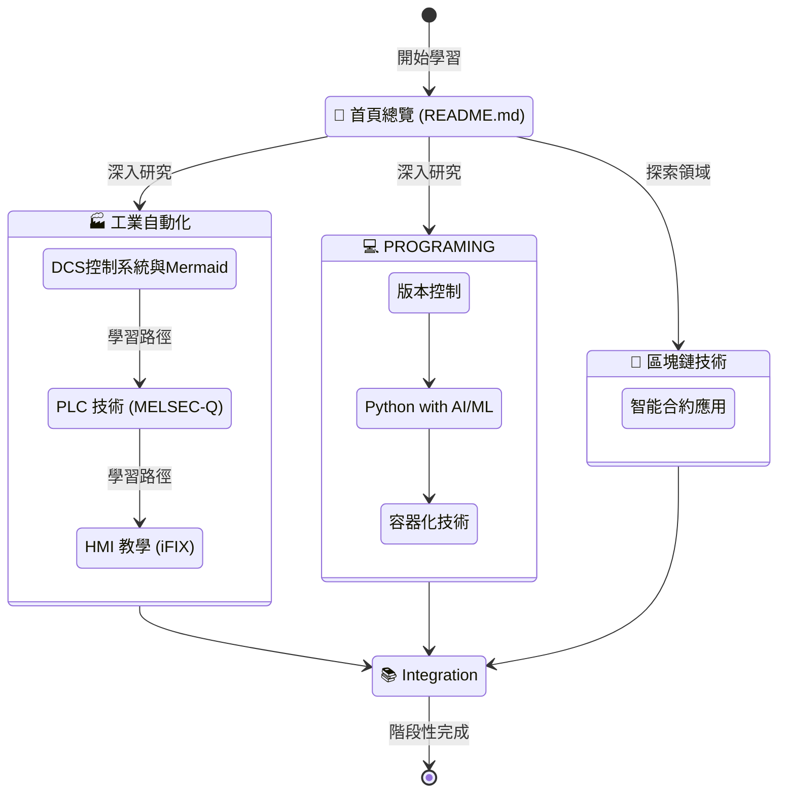

## 👋 歡迎來到我的網頁

我是 Hachi Tsai，除了工業自動化控制外，致力學習AIML/自動化/MCP等科技工具。
試著透過不斷Input/Output，在跨領域中持續融合所學，提昇競爭力。

- 日本語能力試驗一級認證
- 日語實務應用經驗超過10年
- 自學取得證券商高級業務員資格/金融投資相關法規及知識
- 擁有 DCS、PLC、Python 技能
- 探索能源自動化與半導體設備協作
- 🌟積極自主學習新型產業或領域專業知識

目前我正在學習 Python GUI 開發與 SQL 資料處理以及區塊鏈技術與知識。

## 這是我的學習紀錄。請多指教 🙌

## 📚 學習路徑狀態圖

